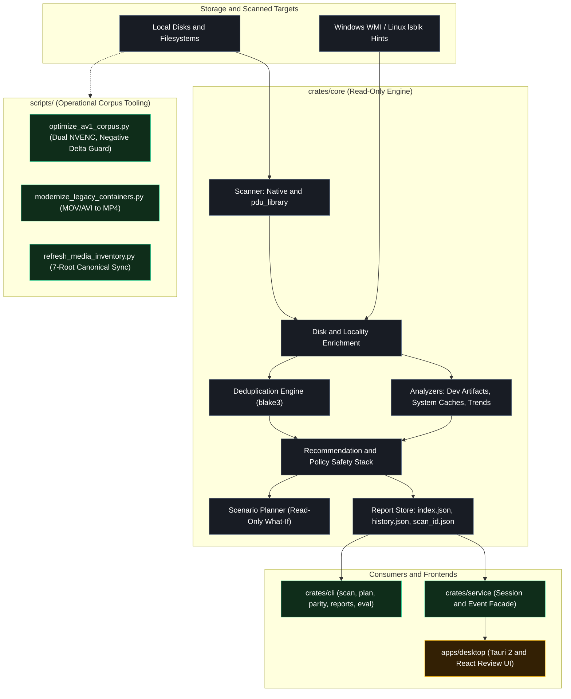

# Architecture Notes (v1.3)

## Goals

- Local-first storage analysis with strict read-only guarantees.
- Explainable recommendations with explicit policy allow/block traces.
- Stable report schema for CLI, service, and desktop UI consumers.
- Cross-platform best-effort scanning with graceful error continuation.

## Workspace Topology

- `crates/core`
  - scanner backends (`native`, `pdu_library`)
  - incremental scan cache (key/signature/TTL best-effort path)
  - device/disk enrichment
  - categorization + disk role inference
  - specialized domain analyzers (`analyzers/` module: `dev_artifacts`, `system_caches`, `trend_analyzer`)
  - duplicate detection
  - recommendation rules + policy invariants
  - scenario planner (read-only what-if projections)
  - diagnostics bundle generator
  - persistent report store, indexing, diffing, and import (`reports.rs`)
  - report schema (`report_version` currently `1.3.0`)
  - evaluator + markdown rendering + doctor diagnostics
- `crates/cli`
  - user-facing commands: `scan`, `recommend`, `doctor`, `eval`, `benchmark`, `parity`
  - scenario planning: `plan`
  - diagnostics export: `diagnostics`
  - persistent report store: `reports` (`list`, `import`, `show`, `diff`)
- `crates/service`
  - application facade for UI/API-style usage
  - scan sessions + event polling + cancellation hooks
  - persistent report store management, scenario planning, and diagnostics bundle exports
- `apps/desktop`
  - Tauri 2 + React read-only review UI
  - guided setup, progress view, results workbench, doctor view
  - scenario planner tab and diagnostics bundle export action
- `scripts/`
  - CI verification and threshold gates (`check_compliance.py`, `check_parity_thresholds.py`, `check_eval_kpi_thresholds.py`, `check_benchmark_regression.py`)
  - corpus optimization and modernization pipeline tooling (`optimize_av1_corpus.py`, `modernize_legacy_containers.py`, `refresh_media_inventory.py`, `media_name_parser.py`, `media_tagger.py`)

## System Architecture Diagram

## Scanner and Backend Design

`ScanBackend` abstraction in `crates/core/src/scan.rs`:
- `NativeBackend`: walkdir-based traversal and aggregation.
- `PduLibraryBackend`: integrates `parallel-disk-usage` tree summaries via `FsTreeBuilder`, while retaining detailed native file-level stats for category/dedupe/recommendation pipeline.
- Incremental cache (optional via `ScanOptions.incremental_cache`):
  - cache key hashes roots + scan-shaping options + backend/report version
  - cache hit requires matching root signatures and TTL window
  - cache IO failures are downgraded to warnings and never fail the scan

Backend parity support:
- `compare_backends(options)` returns timing, absolute counters, and delta metrics in `BackendParity`.
- `crates/core/src/parity.rs` materializes a fixed catalogue of 9 synthetic tree shapes into a caller-supplied scratch workspace and compares both backends on each shape (including flat, deep, wide, empty, mixed sizes, unicode, hidden, depth-limited, and symlinks).
- Used by CLI `parity` / `parity --suite`, the `parity_test` integration test, and the `backend parity` CI job.

Known accounting differences between the backends:
- `parallel-disk-usage` totals every entry it visits; the native sum counts regular files only.
- `directory_entry_bytes`: apparent size of non-root directory entries (the root is already subtracted in `build_pdu_tree_summary`).
- `symlink_entry_bytes`: apparent size of symlink entries, which the native walker skips.
- `largest_directories` rollup differences: native buckets file bytes by first path component directories only, whereas `pdu_library` uses pdu children and includes root files with full recursive sizes.
- Both directory and symlink entries are measured explicitly so known differences cannot masquerade as a traversal regression.

Resolved accounting difference:
- `max_depth` bounding on `pdu_library`: originally `parallel-disk-usage` folded out-of-depth sizes into retained nodes. Core resolved this by summing `depth_bounded_entry_bytes` across nodes within `max_depth`, guarded by the `depth-limited` parity shape.

Parity gate definition (enforced in CI):
- primary signal: `normalized_scanned_bytes_delta`, the residual after removing both accounting terms
- hard limits: `scanned_files_delta == 0`, `normalized_scanned_bytes_delta == 0`, residual ratio at most `0.005`
- `pdu_summary_applied` must be true, so a silent fallback to the native walker fails instead of passing
- gate script: `scripts/check_parity_thresholds.py`; artifact uploads on failure
- promotion criteria: `docs/backend-promotion-checkpoint.md`

## Event and Session Model

Schema types:
- `ScanProgressEvent`
- `ScanPhase`
- `ScanProgressSummary`

Flow:
1. scan emits phase/counter events
2. service stores events per `scan_id`
3. UI/clients poll events (`from_seq`) and session state

Service session states:
- `running`, `completed`, `cancelled`, `failed`

## Recommendation Safety Stack

Rule engine (`recommend.rs`) produces candidate recommendations.
Policy engine (`policy.rs`) enforces non-negotiable constraints:
- target eligibility constraints (cloud/network/virtual/OS exclusions)
- contradiction filtering
- role-aware target policy (blocks active placement onto media/archive/backup role targets)

Recommendation objects include:
- `policy_rules_applied`
- `policy_rules_blocked`
- `policy_safe`

## Disk Intelligence and Role Inference

`DiskInfo` contains:
- locality classification (`local_physical`, `local_virtual`, `network`, `cloud_backed`, `unknown`)
- storage/performance hints + confidence/rationale
- destination eligibility and ineligible reasons
- inferred role hint (`DiskRoleHint`) and target role eligibility

Role inference combines:
- disk label/model signals
- aggregated category scores

OS-specific enrichment providers:
- Windows: best-effort WMI (`Win32_DiskDrive` + partition/logical mapping) hints for model/vendor/interface/rotational signals
- Linux: best-effort `lsblk -J` hints for mount-linked model/vendor/transport/rotational signals
- When provider data is unavailable, heuristics remain the fallback and scan continues without failure

## Report Schema Evolution Strategy

- `report_version` is semantic and additive by default.
- New fields are serde-defaulted where possible to preserve backwards loading.
- v1.3 additive fields include:
  - `scan_id`
  - `scan_progress_summary`
  - `backend_parity`
  - disk role fields
  - recommendation policy rule fields
- `BackendParity` additive fields for the parity gate (all serde-defaulted):
  - `native_scanned_files`, `native_scanned_bytes`
  - `pdu_library_scanned_files`, `pdu_library_scanned_bytes`
  - `pdu_summary_applied`
  - `directory_entry_bytes`, `symlink_entry_bytes`
  - `normalized_scanned_bytes_delta`

## UI Architecture (Read-Only)

`apps/desktop` architecture and stages:
- `setup`: guided root path selection, backend toggle (`native` vs `pdu_library`), and scan tuning options.
- `scanning`: live progress streaming with phase tracking (`discovering`, `analyzing`, `enriching`, `recommending`), real-time file/byte counters, and non-fatal error notices.
- `results`: comprehensive storage analysis workbench organized across 7 dedicated tabs:
  - `disks`: physical/virtual disk locality, total/used/free capacity, and inferred storage roles.
  - `usage`: interactive hierarchical tree map, largest directories, and file extension distributions.
  - `categories`: domain-specific breakdowns (development artifacts, media, archives, system caches, documents).
  - `duplicates`: byte-exact duplicate group review powered by blake3 hash clustering.
  - `scenarios`: interactive what-if projections modeling reclaimable space without modifying user files.
  - `recommendations`: contextual storage recommendations with policy-safe tags, risk ratings, and impact estimations.
  - `rule-trace`: transparent policy audit log displaying passed, skipped, and blocked rules with rationale.
- `compare`: side-by-side comparative diffing between any two historical scans, highlighting directory growth, resolved/new suggestions, and recommendation drift.
- `doctor`: hardware environment diagnostics, WMI/lsblk health checks, and engine readiness inspection.

UI constraints and export actions:
- Strict read-only posture: no file move, delete, or rename actions exist in the UI surface.
- Advisory wording only: clear distinction between analysis findings and actionable safe plans.
- Policy safety indicators: unsafe target destinations (cloud, system, removable) are visually flagged and barred from recommendations.
- Export workflows: exportable Markdown review summaries, raw JSON scan reports, and self-contained diagnostics bundles for offline triage.

## Persistent Report Store Architecture

The local-first report repository decouples report persistence from scan execution:
- Store directory structure (`~/.storage-strategist/reports` or custom `--store-dir`):
  - `index.json`: aggregated catalog index caching lightweight summaries for instant listing and search without loading multi-megabyte trees.
  - `history.json`: global cross-scan timeline tracking cumulative capacity trends and delta shifts.
  - `reports/<scan_id>.json`: complete scan report containing full directory trees, category statistics, duplicate sets, and recommendations.
  - `reports/<scan_id>.summary.json`: standalone summary document for atomic indexing and fast retrieval.
- Historic report diffing (`reports diff` / `compare_reports`):
  - computes size growth, space delta, and file count changes across arbitrary scan pairs.
  - tracks new and resolved category suggestions.
  - highlights recommendation drift between scans.
- Path safety and Windows reserved name guards:
  - scan IDs are strictly sanitized.
  - protected against path traversal patterns and Windows reserved device names (`CON`, `PRN`, `AUX`, `NUL`, `COM1-9`, `LPT1-9`).

## Operational Corpus Tooling and Media Optimization Architecture

The repository enforces a clear separation between analysis and maintenance tooling:
- **Core Rust Toolchain (`crates/*`, `apps/desktop`)**: Strictly read-only on user files. Performs analysis, evidence collection, and advisory recommendation generation without mutating scanned directories.
- **Operational Corpus Tooling (`scripts/`)**: Validated, opt-in automation for high-capacity media corpus optimization and canonical reorganization on managed storage targets (such as `F:\Aloha`).

Architectural safeguards governing corpus optimization (`optimize_av1_corpus.py`, `modernize_legacy_containers.py`):
1. **Hardware Acceleration**: Dual 9th-Gen NVENC architecture on NVIDIA GeForce RTX 5070 Ti running `av1_nvenc` with variable bitrate constant quality (`-rc:v vbr -cq:v <target>`) and universal MP4 faststart output.
2. **Negative Delta Guardrail**: Every transcode is verified against the source before replacement. If output size is greater than or equal to source size (`output_size >= original_size`), the transcode is rejected, temporary files are removed, and the source file is preserved intact.
3. **Multi-layer Stream Probe Verification**: Outputs are probed via `ffprobe` to verify valid AV1 video codec streams, audio channel and codec parity, and container duration consistency within strict tolerances (<= 2.0s).
4. **Metadata and Timestamp Continuity**: QuickTime atoms (`©nam`, `©ART`, `©day`, `©cmt`, `©alb`) are preserved losslessly via Mutagen, and original filesystem access and modification timestamps are restored using `os.utime`.
5. **Same-Volume Atomic Pointer Swaps**: Transcodes stage to hidden temporary files in the same directory (`._tmp_av1_*`), ensuring `os.replace` executes an instantaneous atomic inode/metadata pointer swap rather than an unsafe copy.
6. **Transactional SQLite Ledgers**: Operations are logged in WAL-mode SQLite ledgers (`av1_transcode_ledger.db`, `dir_undo_ledger.db`), recording original sizes, transcoded sizes, reclaimed bytes, compression ratios, and execution statuses for crash resilience and rollback support.
7. **Live Inventory Synchronization**: Updates catalog tables in [media_inventory.db](file:///e:/repos/projects/storage-strategist/media_inventory.db) immediately following each verified transaction.

## Reliability and Error Handling

- traversal errors are converted to warnings and scanning continues.
- permission-denied events are counted in scan metrics.
- symlink traversal disabled by default to avoid loops.
- cancellation is best-effort and cooperative via shared atomic flag.

## CI and Governance

- `CONTRIBUTING.md`: canonical issue-first branch/PR/merge contract
- `.github/workflows/contribution-guardrails.yml`: PR guardrail check for branch naming, Conventional Commit titles, linked issues, and milestone-backed issues
- `.github/workflows/ci.yml`: `Contribution guardrails` + fmt + clippy (`-D warnings`) + tests + compliance checks + desktop smoke tests
- `.github/workflows/bench.yml`: benchmark run + regression threshold check (15%)
- `.github/workflows/desktop-package.yml`: manual desktop packaging matrix (Windows/macOS/Linux) with optional signing env support
- Evaluation KPI definitions (`crates/core/src/eval.rs`):
  - `precision_at_3`: top-3 recommendation hit ratio against case `expected_top_ids`, averaged over suite cases
  - `contradiction_rate`: fraction of cases with `contradiction_count > 0`
  - `unsafe_recommendations`: emitted recommendation count where `policy_safe == false`
- KPI threshold enforcement script: `scripts/check_eval_kpi_thresholds.py`
- AGPL/provenance governance:
  - `THIRD_PARTY_NOTICES.md`
  - `CODE_IMPORT_POLICY.md`
  - `provenance/imported_code.json`
